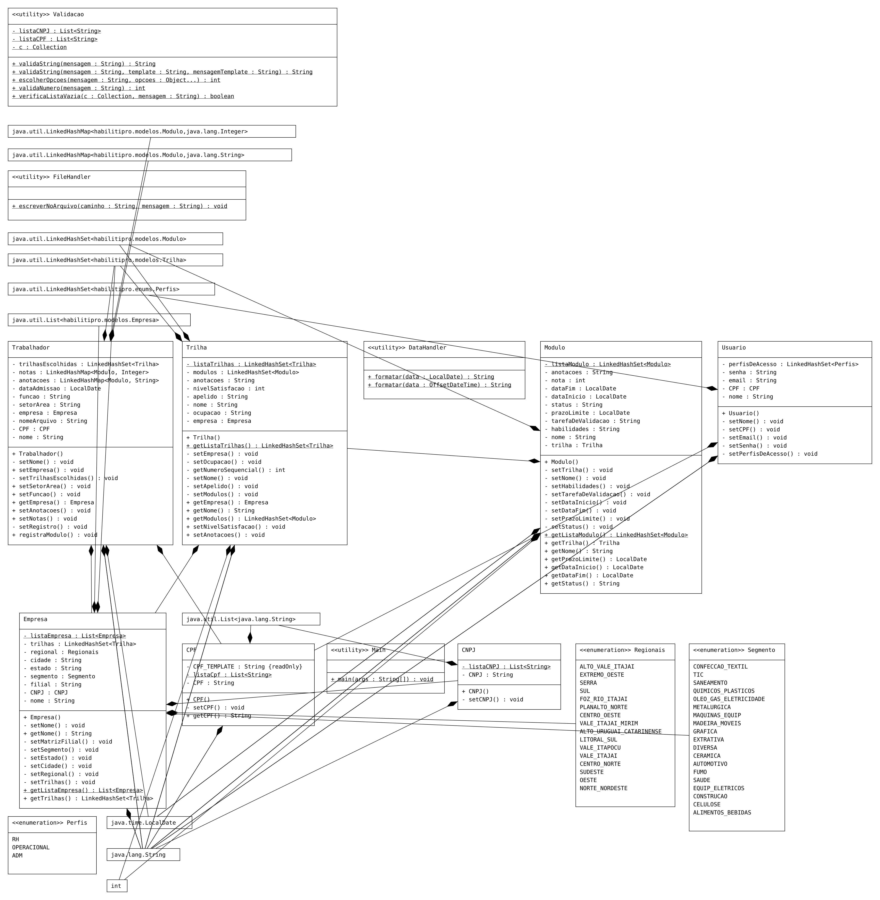

# Projeto 2 - HabilitiPRO

> Projeto focado no cadastro e gerenciamento de entidades para simulação de um projeto real

## Descrição e Estruturação do Projeto:

Projeto composto com diversas funcionalidades, como:

### 1. **Cadastro de**:
- **Empresas**;
- **Trabalhadores**;
- **Trilhas** para cada **Empresa**;
- **Módulos** para cada **Trilha**;
- **Usuários** e seus perfis de acesso;

### 2. Registros de Trabalhador:

- Para cada instância de **Trabalhador**;
- Cada vez que há uma mudança em seu atributo _Setor/Área_;
- Cada vez que há mudança em seu atributo _Função_; 
- A cada mudança em seu atributo _Empresa_; e
- A cada início e término de um Módulo;

### 3. Validação:

- Textual;
- Numérica;
- Para o formato de **CPF**;
- Para o formato de **CNPJ**;
- Para uma senha de acesso com caracteres alfanuméricos;
- Para formato de email válido

## Classes que compõem o projeto:

O Projeto é organizado em diversas pastas para cada tipo de classe e sua competência. 

Em síntese, as classes que a compõem são as seguintes:

- **Enums:**
  - **Perfis:** Onde armazenam os Perfis de Acesso possíveis para o usuário;
  - **Regionais:** Compõem as Regionais do SENAI para popular o atributo _regional_ da entidade **Empresa**;
  - **Segmento:** Composto por um número limitado de segmentos para popular o atributo _segmento_ da entidade **Empresa**;

- **Modelos**  - Entidades responsáveis, em suma, por popular seus atributos. É composto pelas entidades:
  - **Empresa**;
  - **Trabalhador**;
  - **Trilha**;
  - **Módulo**;
  - **Usuário**
- **Util** - Classes com utilidade para além de seu pacote e com presença em quase todo projeto. Contém as seguintes Classes:
  - **DateHandler** - Classe criada com o intuito de formatar as datas no formato LocalDate e OffSetDateTime;
  - **FileHandler** - Classe responsável pelo registro das mudanças dos atributos da entidade **Trabalhador** e status de Módulos em arquivo de texto;
  - **Validacao** - Classe responsável pela validação de dados alfanuméricos, de listas vazias e de templates específicas;
- **Misc** - Contém o controle de registro de:
  - CPF; e
  - CNPJ
> Com o intuito de simular entidades separadas das classes Modelo e validar a existência de um mesmo registro para todas as entidades que contém o mesmo tipo de registro

- **Main** - Classe principal para execução do projeto e para fins de testes de funcionalidade

## Especificidades do Projeto:

- Cada **Trilha** deve ter somente uma **Empresa**;
- Cada **Módulo** deve ter pelo menos uma **Trilha**;
- A **Trilha não pode ser instanciada** sem a existência anterior
de uma **Empresa**, como também um **Módulo** não pode existir 
sem preceder de uma **Trilha**.
- O atributo _status_ da entidade **Módulo** deve ser modificado de acordo com a data Inicial e final do projeto, além da data final para avaliação do desempenho do Trabalhador e quando ainda não se iniciou o módulo;
- O **Trabalhador**, também, não pode ser instanciado sem antes a existência de, no mínimo, 1 **Módulo**, **Trilha** e **Empresa** para se vincular.