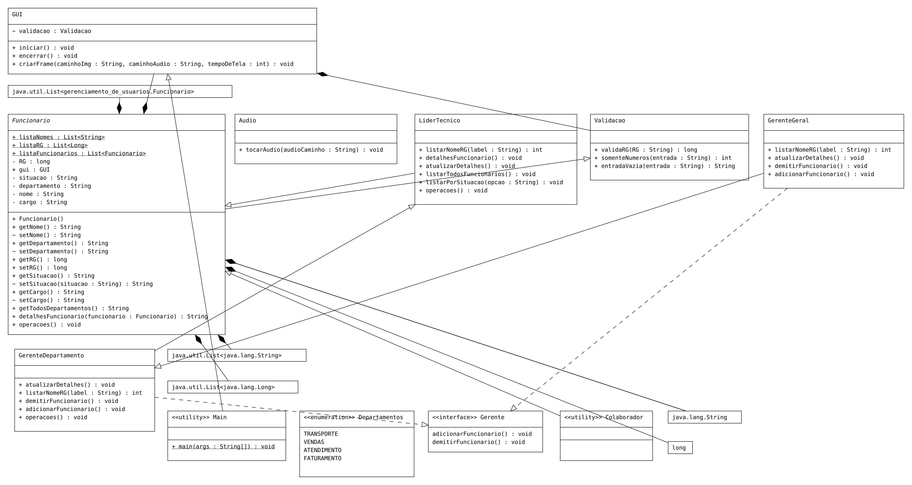

# Gerenciamento de Funcionário

> Aplicação feita inteiramente com Java, com a utilização da biblioteca **Swing** para inserção de dados e interação com o usuário.

## Estruturação

Os cargos definidos, como **Colaborador**, **Líder Técnico**, **Gerente de 
Departamento** e **Gerente Geral** são classes com métodos e atributos
majoritáriamente herdados da classe abstrata **Funcionario**.

A medida em que o cargo aumenta, a classe de maior cargo herda os métodos da classe
abaixo e, além disso, implementa ou cria métodos para maiores
funcionalidades de acordo com a sua competência.

## Métodos de cada Classe

Como há 4 cargos para a manipulação de dados de acordo com sua posição,
4 diferentes interfaces criadas com JOptionPanel são exibidas
de acordo com a classe instanciada:

1. **Colaborador** - Cargo mais baixo da hierarquia. Contém os seguintes métodos: 
   - Alterar dados cadastrados;
   - Visualização detalhada de seus dados.

2. **Lider Técnico** - Já com uma gama maior de métodos, sendo estes:
   - Alterar dados de determinado usuário (somente de cargos iguais ou menores);
   - Visualização de dados detalhados de determidado usuário;
   - Listar todos os funcionários;
   - Listar funcionários trabalhando;
   - Listar funcionários demitidos.

3. **Gerente de Departamento** - Além dos mesmos métodos, outros mais foram criados e implementados:
   - Alterar dados de determinado usuário (menos do Gerente Geral);
   - Demitir funcionário (somente cargos inferiores);
   - Admitir funcionário (também somente cargos inferiores)

4. **Gerente Geral** - O cargo mais alto do gerenciamento de funcionários, 
contém os mesmos métodos que todos os supracitados, com diferença
que pode admitir e/ou demitir inclusive gerentes de departamento.

### Especificações da Aplicação:

- Só pode haver um Gerente Geral;
- Pode também haver somente um Gerente para cada departamento.
- Os cargos inferiores não podem atualizar dados dos cargos maiores que os seus

